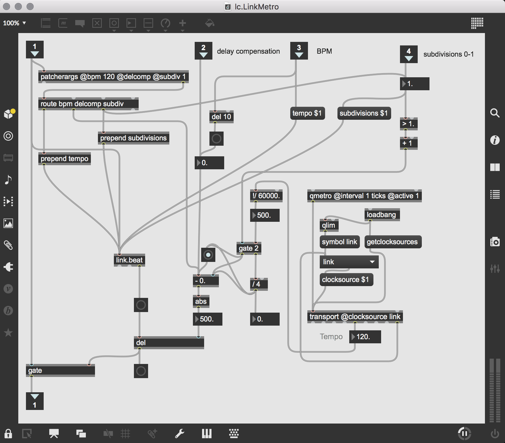

# lc Abstractions 
The concept of abstractions within the MaxMSP framework is far from a new concept. Heavily inspired from Gregory Taylors book "Step by Step Adventures in Sequencing with MaxMSP" view on abstractions, this repository aims at exploring the creative networking possibilities that lies within this approach to patching.

I am currently at a point where I have gone through extensive courses with MaxMSP and having used it in a variety of use-cases spanning from multichannel sound installations to creating max for live devices. Yet I have always felt that there was a lack of reuseabilty building up a sort of archive of usefull abstractions tailored to the way I like patching with MaxMSP.

*lc Abstractions* is an assemblage of my personal abstractions and my ongiong iterative proces of evovling these abstractions to suit my approach to patching.

## What are MaxMSP Abstractions?
Taylors chapter on abstractions is a really good way to get a fundamental understanding of abstractions.

> "(...) the ability to have parts of your patching logic live in separate reusable files that you can then use inside of any Max patcher you like." 

This concept reminds me of subpatchers within max, which are a very efficient way to organize your patcher from cable/object clutter. A big difference between subpatchers and abstractions are that subpatchers cant be reused within other patchers per default. Whereas abstractions are inherently meant for reuse within whatever patcher, and are accessable just by typing the name of the .maxpat file, as long as the abstractions would be located somewhere that Max has been made aware off

## lc.LinkMetro

Imagine that you are building something cool in max and then you think it would be cool to route the audio into ableton while being able to add elements in ableton that will be synced to the same temporality as the patch is utilising in max.

activate the object using a toggle-object, then set the bpm and make sure ableton link is on. Set the delay compensation depending on your need. Be aware that the timing will never be 100% perfect, but by utilising the compensation you can definatly get close.

This abstraction is build around the link.beat object that lets Max be synchronised with other applications using the Abelton Link framwork. This abstraction makes it possible to compensate for the latency between standalone maxmsp and ableton. While it is possible to run max for live natively within Ableton with no timing issues, I dont find that it works in the favor of Maxmsp's inherent experimental abilities, and instead confines and constrains the algorithms to be used for max-for-live objects.